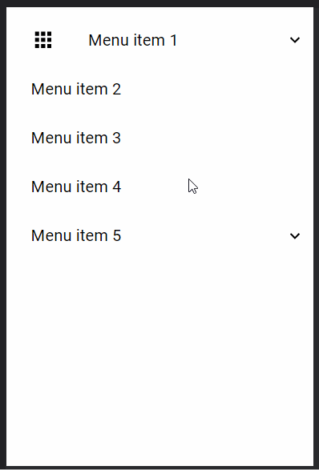

# &lt;fc-applayout&gt;

[](https://vaadin.com/directory/component/flowingcodefc-menuitem)

[&lt;fc-menuitem&gt;](https://vaadin.com/components/fc-menuitem) is a Web Component that displays a hierarchical menu.




## Example Usage
```html
    <fc-menuitem icon="apps" label="Menu item 1" >
      <fc-menuitem label="Menu item 1-2" slot="menu-item" href="https://www.google.com" onMenuItemClicked="alert('clicked Menu item 1-2')"></fc-menuitem>
    </fc-menuitem>
    <fc-menuitem label="Menu item 2" onMenuItemClicked="alert('clicked Menu item 2')" href="/"></fc-menuitem>
    <fc-menuitem label="Menu item 3"></fc-menuitem>
    <fc-menuitem label="Menu item 4"></fc-menuitem>
    <fc-menuitem label="Menu item 5">
      <fc-menuitem label="Menu item 5.1" slot="menu-item">
        <fc-menuitem label="Menu item 5.1.1" slot="menu-item"/>
      </fc-menuitem>
    </fc-menuitem>
```